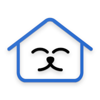

# NewHome

Aplicativo para adoção de animais.

Equipe:

- Gabriel Maia Gondim ([gabrielmaia2](https://github.com/gabrielmaia2/)).

Links:

- [Documento de Visão](Documento%20de%20visão%20-%20NewHome.docx)
- [Documento de Visão (online)](https://docs.google.com/document/d/1zmXHlqlolZHsC0Sm9svI_SMwjibPqeP6LgyG272uRvc/edit?usp=sharing)
- [Plano de Medição de Qualidade](Plano%20de%20Medição%20de%20Qualidade.docx)
- [Plano de Medição de Qualidade (online)](https://docs.google.com/document/d/1mCOTPBDO8tD4Ev3KoJYHSR2_iL5ClGwA/edit?usp=sharing)
- [Trello](https://trello.com/b/wDqJiqbW)
- [Protótipo](https://www.figma.com/file/Ynqz8XqNbdFSNU1TjwKW5D/NewHome?node-id=0%3A1)
- [Protótipo navegável](https://www.figma.com/proto/Ynqz8XqNbdFSNU1TjwKW5D/NewHome?node-id=7%3A2&scaling=scale-down&page-id=0%3A1&starting-point-node-id=7%3A2&show-proto-sidebar=1)
